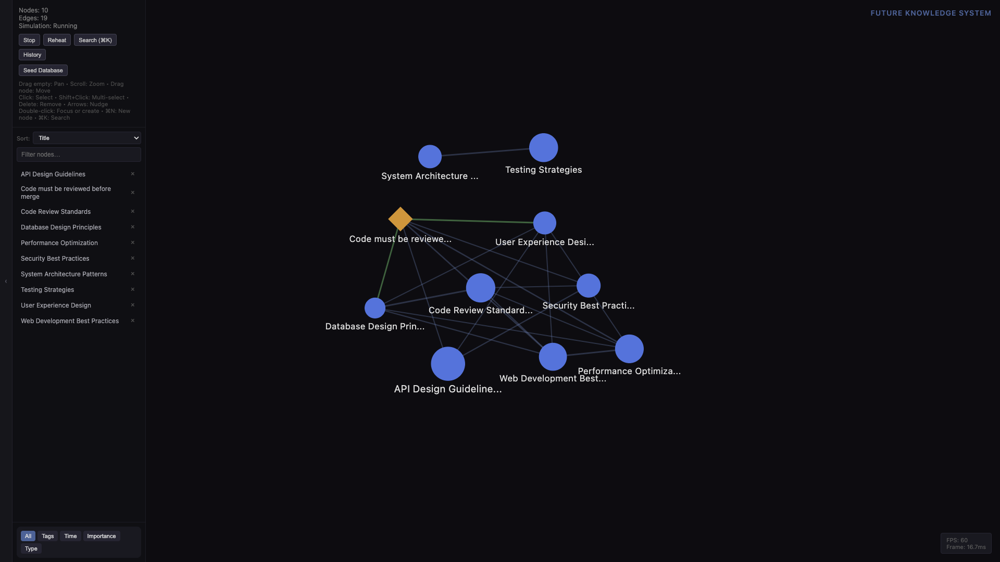
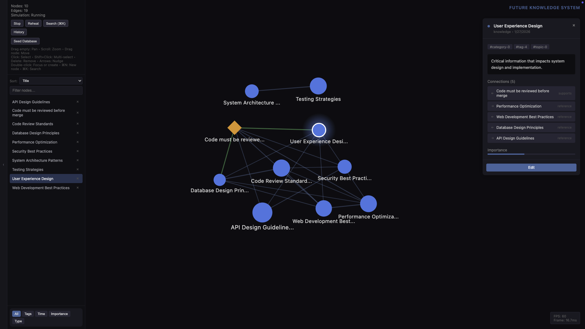
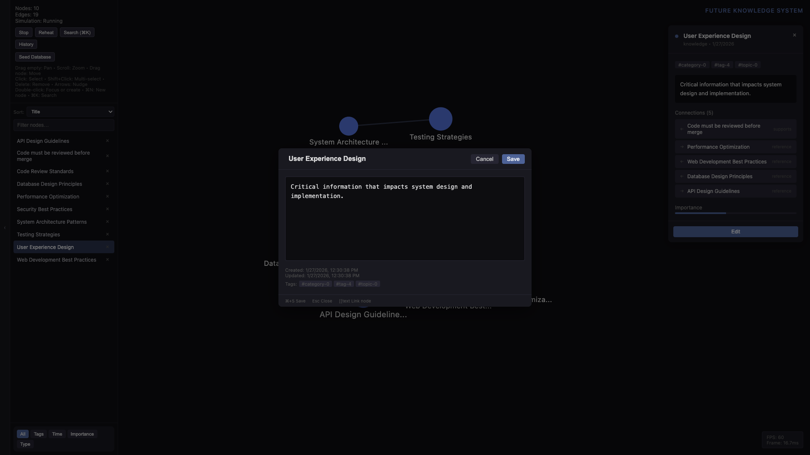

# Future Knowledge System

A **local-first** knowledge application where knowledge exists as a **continuous semantic field**: nodes attract and repel by relationships, and focus or drag reshape the space. No folders, no canonical list—meaning comes from proximity, links, and time.



## Principles (from project rules)

- **Local-first, web-native.** Knowledge as continuous semantic field; documents are temporary projections. No primary page view, no folder tree.
- **Knowledge behaves like matter.** Ideas have weight, exert influence, drift, cluster. Attention as gravity; focus and drag move the field—viewport stays put.
- **Spatial layout as primary interface.** Distance = relevance; motion = change. Authored instrument, not a platform. Clarity over flexibility; no proprietary SDKs, no cloud.

---

## Features

- **Semantic field** — Nodes (knowledge, rules, decisions) in a force-directed graph. Canvas 2D rendering; D3 force simulation in a web worker at 30Hz. Focus and drag act as gravity; radial bound keeps nodes from drifting to infinity.
- **Node types** — **Knowledge** (content, tags, importance), **Rule** (scope, enforcement), **Decision** (context, alternatives, status). Edges: explicit (`[[wiki]]`, markdown links) or implicit (similarity).
- **Left panel** — Collapsible. Top: counts, Start/Stop, Reheat, Search, History, Seed Database, hints. Middle: **node list** with filter (with clear), sort (type, title, importance, tag), per-row delete. Bottom: **lens** selector (All, Tags, Time, Importance, Type). Hints brighten on hover.
- **Search** — FlexSearch full-text, Cmd+K. Result list; select and focus. Zoom-to-fit on open when most nodes are off-screen; forces pause during that animation.
- **View lenses** — Filter and emphasize by tags, time, importance, or type.
- **Seed Database** — Presets 10 / 100 / 1000 / 10000 nodes (cap 10k), optional custom; edges derived. Clear-existing option. Works in-memory when IndexedDB is unavailable.
- **Persistence** — IndexedDB (Dexie). Auto-save with debounce. Explicit open with retry; single-instance lock in Electron. If the DB cannot open: banner, in-memory mode, Seed and graph still work.
- **History & Timeline** — Snapshots, restore, time travel.
- **Inline editor** — Markdown with `[[wiki]]` links. Open via double-click (focus) or ⌘N (new at view centre).
- **Performance monitor** — FPS and frame time in the bottom-right.
- **Import** — Markdown/JSON import (see `import/`).



---

## Getting Started

```bash
npm install
npm run dev    # development
npm run build  # production
```

---

## Controls

| Action | Input |
|--------|--------|
| **Pan** | Drag on empty (left or middle button) |
| **Zoom** | Scroll wheel or pinch |
| **Move node** | Drag node |
| **Select** | Click node |
| **Multi-select** | Shift+Click or ⌘/Ctrl+Click |
| **Focus / open** | Double-click node |
| **Create on empty** | Double-click empty |
| **New node** | ⌘N / Ctrl+N (at view centre) |
| **Search** | ⌘K / Ctrl+K |
| **History** | ⌘H / Ctrl+H |
| **Delete** | Delete / Backspace (selected) |
| **Nudge** | Arrow keys (Shift = larger step) |
| **Select all** | ⌘A / Ctrl+A |



---

## Architecture

```
src/
├── main/           # Electron main (single-instance lock, IPC)
├── preload/        # Context bridge
└── renderer/
    ├── core/       # Types (node, edge), stores (field, viewport), event bus
    ├── semantic/   # Force (D3 in worker), search (FlexSearch), lenses, similarity
    ├── render/     # Canvas 2D (RenderEngine), viewport, LOD
    ├── interaction/# InteractionEngine (mouse/touch), Viewport (pan/zoom)
    ├── persistence/# Dexie (db, ensureDbOpen), autoSave, seed, history
    ├── markdown/   # Parser, InlineEditor, [[wiki]] extraction
    ├── import/     # Markdown/JSON import
    └── components/ # React: Canvas, LeftPanel, SearchBar, SeedDatabase, etc.
workers/
└── forceWorker.ts  # D3 force simulation, radial bound, tick at 30Hz
```

---

## Tech Stack

- **Electron** — Desktop; single-instance lock to avoid IndexedDB contention.
- **TypeScript** — Language.
- **React** — UI (LeftPanel, modals, overlay). Graph is Canvas 2D, not React.
- **Canvas 2D** — Graph (nodes, edges, labels, selection, hover dim, lens).
- **D3-force** — Simulation in a web worker.
- **Dexie** — IndexedDB; `ensureDbOpen` with retry, degraded in-memory when unavailable.
- **Zustand** — fieldStore, viewportStore.
- **unified / remark** — Markdown.
- **FlexSearch** — Full-text search.

---

## Docs

- **Cursor rules** (`.cursor/rules/`): `fks-principles`, `fks-ux`, `fks-interaction`, `fks-data-model`, `fks-force-and-spatial`, `fks-stack-and-layers`.
- **Prompts** in `docs/` for design context (Chat GPT, Claude, Cursor).
